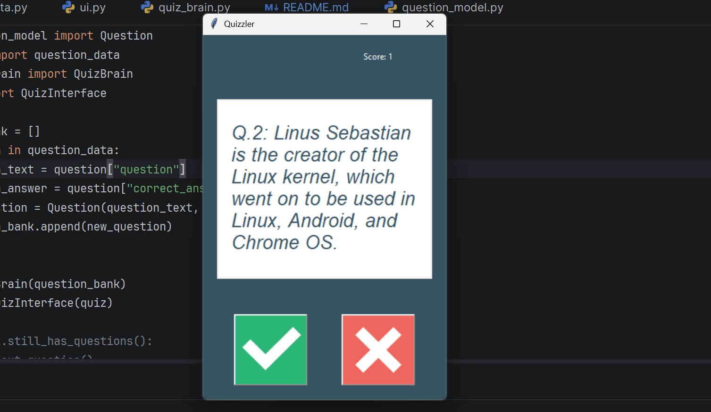

# 🎯 Interactive Quizzler

An interactive Python quiz application built with Tkinter that fetches True/False computer science trivia questions from the Open Trivia Database API.

The app presents questions in a graphical interface, tracks the player's score, gives instant visual feedback for correct and incorrect answers, and ends cleanly when all questions have been answered.

---

## 🚀 Features

- Fetches real-time quiz questions from the Open Trivia Database API
- Uses the Science: Computers category for focused trivia
- Interactive graphical user interface built with Tkinter
- Real-time score tracking
- Instant answer feedback with color changes
- Automatically disables buttons when the quiz ends

---

## 🛠 Technologies Used

- Python
- Tkinter
- Requests
- Open Trivia Database API

**API Source:** `https://opentdb.com/`

---

## 📂 Project Structure
```bash
interactive_quizzler
│
├── main.py
├── data.py
├── quiz_brain.py
├── question_model.py
├── ui.py
│
├── images
│   ├── true.png
│   └── false.png
│
└── README.md
```

---

## 📸 Preview

Below is an example of the Interactive Quizzler interface while running:



---
## ⚙️ Installation

Clone the repository
```
git clone https://github.com/sudinkatuwal7/interactive_quizzler.git
```
Navigate to the project folder
```
cd interactive_quizzler
```
Install dependencies
```
pip install requests
```
Run the application
```
python main.py
```
---

## 🧠 How It Works

1. `data.py` requests 10 True/False questions from the Open Trivia Database API.
2. Questions are filtered to the Science: Computers category.
3. `question_model.py` creates question objects.
4. `quiz_brain.py` manages quiz flow, scoring, and answer checking.
5. `ui.py` displays the quiz through a Tkinter GUI and provides visual feedback.

---

## 📌 Current Functionality

- Loads 10 computer science True/False questions
- Displays one question at a time
- Updates the score after each correct answer
- Shows green for correct answers and red for incorrect answers
- Ends the quiz with a completion message

---

## 🔮 Future Improvements

- Add multiple choice support
- Add difficulty selection
- Add category selection
- Display final score at the end more clearly
- Add a restart quiz button
- Improve UI styling and layout

---

## 👨‍💻 Author

Sudin Katuwal